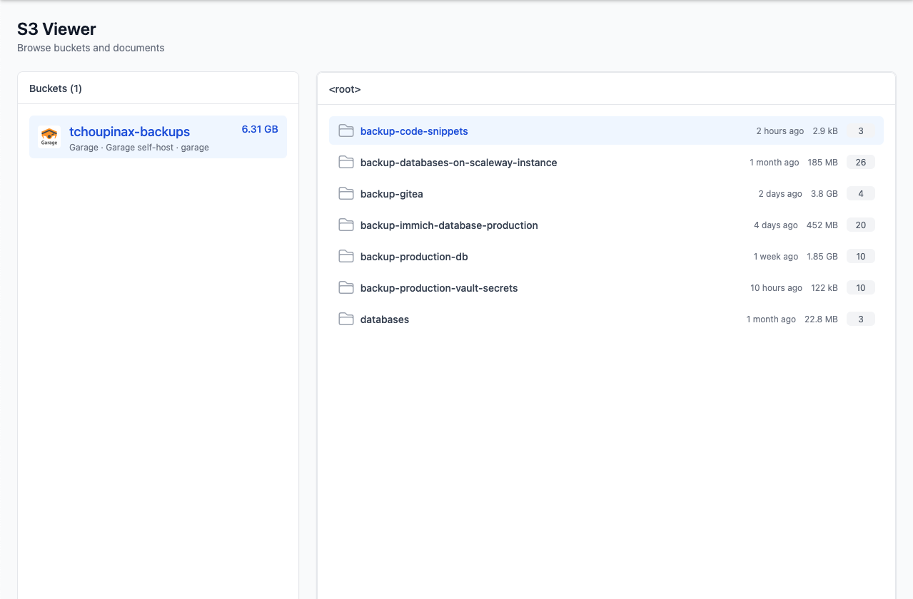

# 🪣 S3 Viewer

A lightweight web UI to browse, preview, and manage objects across multiple S3-compatible storage backends — from a single Docker container or a fleet of Kubernetes instances.



Connect AWS, Garage, Scaleway, OVH, MinIO, or any S3-compatible endpoint. Configure one or many accounts via environment variables (Docker) or Kubernetes custom resources (operator).

---

## Features

- **Multi-account dashboard** — list buckets from every configured account in one place, with per-provider storage stats.
- **File explorer** — tree view of objects and folders, with size and last-modified metadata.
- **Preview** — open text and code files in the browser (syntax highlighting via Shikiji).
- **Download** — download individual objects.
- **Delete** — remove files or folders, with a preview step and live progress for large deletions.
- **Empty bucket** — wipe a bucket with a preview and progress tracking.
- **Read-only accounts** — mark an account as read-only; write operations are blocked in the UI.
- **Kubernetes-native** — a Rust operator reconciles `S3Viewer` and `S3ViewerConfig` resources into Deployments, Secrets, Services, and Ingresses.

### Supported providers

| Provider  | Status |
|-----------|--------|
| AWS       | ✅     |
| Garage    | ✅     |
| Scaleway  | ✅     |
| OVH       | ✅     |
| MinIO     | ✅     |

Any S3-compatible endpoint works as long as you provide the correct endpoint URL and credentials.

---

## Quick start (Docker)

### Pull an image

Published images are available on Docker Hub and GitHub Container Registry:

```
ghcr.io/tchoupinax/s3-viewer:latest
docker.io/tchoupinax/s3-viewer:latest
```

Tagged releases follow semver, e.g. `v0.2.0`.

### Run with one account

Each S3 account is configured with a set of environment variables. The pattern is:

```
S3_VIEWER_ACCOUNT_<KEY>_<FIELD>
```

`<KEY>` is an arbitrary identifier you choose (e.g. `BACKUPS`, `MEDIA`). `<FIELD>` is one of:

| Field        | Required | Description                              |
|--------------|----------|------------------------------------------|
| `ACCESS_KEY` | yes      | S3 access key                            |
| `SECRET_KEY` | yes      | S3 secret key                            |
| `ENDPOINT`   | yes      | S3 API endpoint URL                      |
| `ID`         | yes      | Internal account id (used in bucket ids) |
| `NAME`       | yes      | Display name in the UI                   |
| `REGION`     | yes      | AWS region or provider region code       |
| `READ_ONLY`  | no       | Set to `true` to disable write actions   |

```bash
docker run --rm -p 3000:3000 \
  -e S3_VIEWER_ACCOUNT_BACKUPS_ACCESS_KEY=minio \
  -e S3_VIEWER_ACCOUNT_BACKUPS_SECRET_KEY=minio123 \
  -e S3_VIEWER_ACCOUNT_BACKUPS_ENDPOINT=http://localhost:9000 \
  -e S3_VIEWER_ACCOUNT_BACKUPS_ID=local-minio \
  -e S3_VIEWER_ACCOUNT_BACKUPS_NAME=Backups \
  -e S3_VIEWER_ACCOUNT_BACKUPS_REGION=us-east-1 \
  ghcr.io/tchoupinax/s3-viewer:latest
```

Open [http://localhost:3000](http://localhost:3000).

### Multiple accounts

Add another prefix block with a different key:

```bash
docker run --rm -p 3000:3000 \
  -e S3_VIEWER_ACCOUNT_ANALYTICS_ACCESS_KEY=<access-key> \
  -e S3_VIEWER_ACCOUNT_ANALYTICS_SECRET_KEY=<secret-key> \
  -e S3_VIEWER_ACCOUNT_ANALYTICS_ENDPOINT=https://s3.fr-par.scw.cloud \
  -e S3_VIEWER_ACCOUNT_ANALYTICS_ID=analytics \
  -e S3_VIEWER_ACCOUNT_ANALYTICS_NAME=Analytics \
  -e S3_VIEWER_ACCOUNT_ANALYTICS_REGION=fr-par \
  -e S3_VIEWER_ACCOUNT_BACKUP_ACCESS_KEY=<access-key> \
  -e S3_VIEWER_ACCOUNT_BACKUP_SECRET_KEY=<secret-key> \
  -e S3_VIEWER_ACCOUNT_BACKUP_ENDPOINT=https://s3.fr-par.scw.cloud \
  -e S3_VIEWER_ACCOUNT_BACKUP_ID=backup \
  -e S3_VIEWER_ACCOUNT_BACKUP_NAME=Backup \
  -e S3_VIEWER_ACCOUNT_BACKUP_REGION=fr-par \
  ghcr.io/tchoupinax/s3-viewer:latest
```

### Build from source

```bash
pnpm install
pnpm build

docker build -f apps/s3-viewer/Dockerfile -t s3-viewer .
docker run --rm -p 3000:3000 -e S3_VIEWER_ACCOUNT_... s3-viewer
```

The app listens on port **3000** (`HOST=0.0.0.0`, `PORT=3000`).

---

## Kubernetes + operator

For production clusters, use the **s3-viewer operator** — a Rust controller (kube-rs) that turns declarative custom resources into running S3 Viewer instances.

### Architecture

```
┌─────────────────────────────────────────────────────────────────┐
│  S3ViewerConfig (namespace: copper)                             │
│    accounts: [ MEDIA ]                                          │
└──────────────────────────┬──────────────────────────────────────┘
                           │ watched via configNamespaces
┌──────────────────────────▼──────────────────────────────────────┐
│  S3Viewer (namespace: iron)                                     │
│    configNamespaces: [copper, iron]                             │
│                                                                 │
│  Operator reconciles →                                          │
│    Secret (S3_VIEWER_ACCOUNT_* env)                             │
│    Deployment (s3-viewer container)                             │
│    Service                                                      │
│    Ingress (optional)                                           │
└─────────────────────────────────────────────────────────────────┘
```

An `S3Viewer` can define accounts **inline** in its spec, **or** ingest them from `S3ViewerConfig` resources in one or more namespaces. By default it only reads configs in its own namespace; set `spec.configNamespaces` to watch other namespaces (the operator's ServiceAccount needs RBAC there).

### Install with Helm

Prerequisites: Kubernetes 1.25+, Helm 3.

**Operator only:**

```bash
helm install s3-viewer ./charts/s3-viewer
```

**Operator + an instance** (inline accounts):

```bash
helm install s3-viewer ./charts/s3-viewer \
  --set s3viewer.enabled=true \
  -f my-instance-values.yaml
```

See [`charts/s3-viewer/values.yaml`](charts/s3-viewer/values.yaml) and [`charts/s3-viewer/README.md`](charts/s3-viewer/README.md) for the full Helm values schema.

**Install CRDs manually** (if not using Helm):

```bash
kubectl apply -f charts/s3-viewer/crds/
```

### Operator image

```
ghcr.io/tchoupinax/s3-viewer-operator:latest
```

Build locally:

```bash
docker build -f apps/s3-viewer-operator/Dockerfile -t s3-viewer-operator apps/s3-viewer-operator

docker run --rm \
  -v ~/.kube/config:/kube/config:ro \
  -e KUBECONFIG=/kube/config \
  s3-viewer-operator
```

| Variable                  | Default                              | Description                          |
|---------------------------|--------------------------------------|--------------------------------------|
| `S3_VIEWER_DEFAULT_IMAGE` | `ghcr.io/tchoupinax/s3-viewer:latest` | App image when `spec.image` is omitted |
| `KUBECONFIG`              | `~/.kube/config`                     | Kubernetes API access                |

### Deploy an S3Viewer instance

**1. Create a credentials Secret** (in the same namespace as the account, or wherever `credentialsSecretRef` points):

```yaml
apiVersion: v1
kind: Secret
metadata:
  name: minio-backups-creds
  namespace: default
type: Opaque
stringData:
  access-key: minio
  secret-key: minio123
```

**2. Create the S3Viewer:**

```yaml
apiVersion: s3viewer.dev/v1
kind: S3Viewer
metadata:
  name: home
  namespace: default
spec:
  replicas: 1
  accounts:
    - accountKey: BACKUPS
      id: minio-backups
      name: Backups
      endpoint: http://minio.minio.svc.cluster.local:9000
      region: us-east-1
      readOnly: false
      credentialsSecretRef:
        name: minio-backups-creds
        accessKeyKey: access-key
        secretKeyKey: secret-key
  service:
    port: 3000
    type: ClusterIP
  ingress:
    host: s3-viewer.example.com
    className: nginx
    tlsSecretName: s3-viewer-tls
```

```bash
kubectl apply -f instance.yaml
kubectl get s3viewers
kubectl describe s3viewer home
```

The operator creates owned resources (Secret, Deployment, Service, optional Ingress). Deleting the `S3Viewer` removes them via owner references.

**Status fields** written back to the CR:

| Field                | Description                                      |
|----------------------|--------------------------------------------------|
| `status.ready`       | Deployment has ready replicas                    |
| `status.url`         | In-cluster service URL or ingress URL            |
| `status.message`     | Human-readable reconciliation result             |
| `status.lastSyncTime`| RFC3339 timestamp of last successful reconcile   |

### S3ViewerConfig — shared bucket definitions

Use `S3ViewerConfig` to declare accounts separately from the viewer instance. This is useful when multiple teams own credentials in different namespaces, or when you want to reuse the same bucket definitions across viewers.

```yaml
apiVersion: s3viewer.dev/v1
kind: S3ViewerConfig
metadata:
  name: media
  namespace: copper
spec:
  accounts:
    - accountKey: MEDIA
      id: minio-media
      name: Media
      endpoint: http://minio-media.minio.svc.cluster.local:9000
      region: us-east-1
      credentialsSecretRef:
        name: minio-media-creds
        accessKeyKey: access-key
        secretKeyKey: secret-key
```

```yaml
apiVersion: s3viewer.dev/v1
kind: S3Viewer
metadata:
  name: main
  namespace: iron
spec:
  configNamespaces:
    - copper   # ingest S3ViewerConfigs from copper
    - iron     # and from iron (default when omitted)
  ingress:
    host: s3.example.com
```

When the same `accountKey` appears in multiple configs, the operator prefixes it with the config name (e.g. `media_MEDIA`) to avoid collisions.

Cross-namespace reads require the operator ServiceAccount to have `get/list/watch` on `S3ViewerConfig` and `Secret` resources in those namespaces.

---

## CRD schema reference

### S3Viewer (`s3viewers.s3viewer.dev`)

| Field | Type | Default | Description |
|-------|------|---------|-------------|
| `spec.image` | string | operator default | Container image for the app |
| `spec.replicas` | int | `1` | Deployment replicas |
| `spec.accounts` | []Account | `[]` | Inline S3 accounts |
| `spec.configNamespaces` | []string | viewer namespace | Namespaces to scan for `S3ViewerConfig` |
| `spec.service.port` | int | `3000` | Service port |
| `spec.service.type` | string | `ClusterIP` | Kubernetes Service type |
| `spec.ingress.host` | string | — | Ingress hostname (enables Ingress when set) |
| `spec.ingress.className` | string | — | Ingress class name |
| `spec.ingress.tlsSecretName` | string | — | TLS secret for HTTPS |

### S3ViewerConfig (`s3viewerconfigs.s3viewer.dev`)

| Field | Type | Default | Description |
|-------|------|---------|-------------|
| `spec.accounts` | []Account | `[]` | S3 accounts exposed to watching `S3Viewer` instances |

### Account (shared by both CRDs)

| Field | Type | Required | Description |
|-------|------|----------|-------------|
| `accountKey` | string | yes | Env prefix (`BACKUPS` → `S3_VIEWER_ACCOUNT_BACKUPS_*`). Letters, numbers, underscores only. |
| `id` | string | yes | Internal account identifier |
| `name` | string | yes | Display name in the UI |
| `endpoint` | string | yes | S3 API endpoint URL |
| `region` | string | yes | Region code |
| `readOnly` | bool | no | Disable write operations (default `false`) |
| `credentialsSecretRef.name` | string | yes | Kubernetes Secret name |
| `credentialsSecretRef.accessKeyKey` | string | yes | Key in the Secret for the access key |
| `credentialsSecretRef.secretKeyKey` | string | yes | Key in the Secret for the secret key |

---

## Local development

The repo is a pnpm + Turborepo monorepo:

| Package | Path | Description |
|---------|------|-------------|
| `@s3-viewer/app` | `apps/s3-viewer` | Nuxt 4 web application |
| `s3-viewer-operator` | `apps/s3-viewer-operator` | Rust Kubernetes operator |
| Helm chart | `charts/s3-viewer` | Operator, CRDs, optional instances |

**Run the app locally:**

```bash
pnpm install
pnpm watch          # Nuxt dev server on :3000
```

Set `S3_VIEWER_ACCOUNT_*` variables in a `.env` file or your shell.

**Run against a local k3d cluster (Tilt):**

```bash
cp dev/secret.example.yaml dev/secret.yaml   # edit credentials
pnpm cluster:up    # k3d cluster + registry
pnpm deploy      # Tilt: operator, MinIO, sample S3Viewer instances
```

Sample instances:

| Instance | URL | Pattern |
|----------|-----|---------|
| aluminium | http://aluminium.127.0.0.1.nip.io | Inline accounts |
| copper | http://copper.127.0.0.1.nip.io | `S3ViewerConfig` in same namespace |
| iron | http://iron.127.0.0.1.nip.io | Cross-namespace `configNamespaces` |

**Run the operator locally:**

```bash
pnpm operator     # cargo run with file watching
```

**Regenerate CRDs** after changing Rust types:

```bash
pnpm crd:generate
```

---

## Health check

```
GET /api/health
```

Use this endpoint for container and Kubernetes liveness/readiness probes.

---

## License

See the repository for license information.
